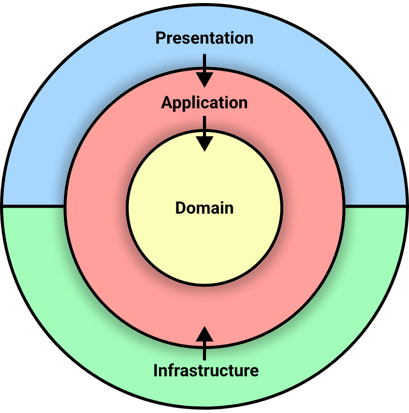

#### I use Clean Architecture to ensure that the project is well-organized and maintainable. Clean Architecture promotes a clear separation of concerns, which simplifies development and testing. Here's how the architecture is organized:
## Overview of the Structure

- **TabibApp.Infrastructure**: Handles configurations, data access, and dependency injection.
  - **Configuration**: Entity configurations for the database.
  - **Data**: Database context and related classes.
  - **DependencyInjection**: Service registration for dependency injection to make the main program file cleaner.

- **TabibApp.Domain**: Core business logic and entities.
  - **Entities**: Business entities like Patient, Doctor, Appointment, etc.

- **TabibApp.Application**: Application-specific business logic and service interfaces.
  - **Interfaces**: Service interfaces like IEmailSender.
  - **Services**: Implementations of application services.

- **TabibApp.API**: Presentation layer, including the API.
  - **Controllers**: API controllers to handle HTTP requests.
  - **Models**: Data transfer objects (DTOs) for the API.
  - **Startup.cs & Program.cs**: Configuration and entry point for the API.

